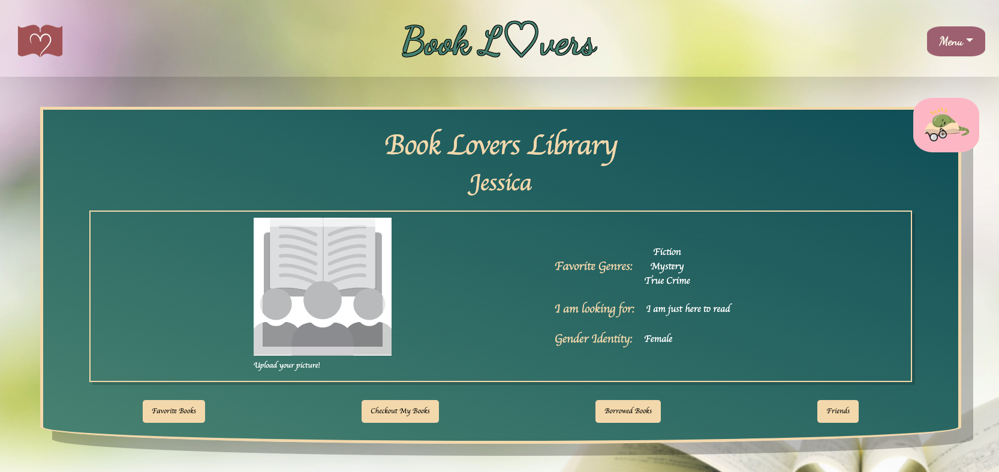

# Book-Lovers

Github: https://github.com/BookLovers-Group3/Book-Lovers-Official

## Description

This project originated as the third undertaking within a comprehensive full-stack development bootcamp. Our aim was to reimagine the concepts inherent in social media and dating applications, focusing them on a common passion: a love for books. Our goal is to foster book lending, creating opportunities for meaningful connections to flourish among individuals who share a profound appreciation for stories.

## Table of Contents

- [User-Story](#User-Story)
- [Installation](#Installation)
- [Usage](#Usage)
- [Contributing](#Contributing)
- [Libraries](#Libraries)
- [References](#References)
- [Deployed-Link](#Deployed-Link)
- [Created-By](#Created-By)
- [License](#License)

## User-Story

As a passionate book enthusiast, I aim to connect with like-minded individuals who share my deep love for reading. Book-Lovers serves as a dedicated platform where users can not only share their favorite book recommendations but also engage in the joy of lending and borrowing books within a community that values the magic of storytelling.

Additionally, Book-Lovers goes beyond the conventional boundaries of social platforms. Whether you're seeking new friends to discuss the latest literary gems, looking for a potential life partner who appreciates the written word as much as you do, or simply yearning to share your enthusiasm for books, this platform is designed to fulfill those desires.

Join Book-Lovers to explore a world where connections are forged through the shared love of stories, allowing you to discover new books, build meaningful relationships, and celebrate the beauty of reading together.

## Local Installation

### 1. Install dependencies

        - npm install

### 2. Set up environmental variables

       - Create a .env file in the root directory.
       - Add the necessary environment variables (database connection strings, Google Books API Key).

## Usage

Book-Lovers offers a user-friendly interface to seamlessly connect with fellow book enthusiasts and explore the world of literature together. Below are some key features and instructions on how to use them:

### 1. Populate Your Personal Library

- Navigate to the "Search Books" section to discover a curated collection of book recommendations from the community.
- Visit users' profiles to see their favorite books and connect with them by becoming friends!

### 2. Lend and Borrow Books

- Head to the "Borrow Books" section where you can borrow books from fellow users.
- Initiate a book lending request or respond to lending requests from others.

### 3. Connect with Like-Minded Readers

- Explore user profiles to learn more about their reading preferences and connect with those who share similar interests.
- Become friends and see the books they have lent out and borrowed from others.
- If you borrow more than five books from each other, an encouraging message might appear on their profile page, prompting you to connect!

### 4. Customize Your Profile

- Personalize your profile by adding your favorite genres during signup, listing your favorite books, and populating your lending library.
- Upload a profile picture to enhance your Book-Lovers experience.

### 5. Find Friends and Partners

- Utilize the platform to discover new books and connect with friends, potential life partners, or fellow book club enthusiasts.

### 6. Contribute to the Community

- Share your own book recommendations and list books available for lending.

Feel free to explore all the features and make Book-Lovers a place where your love for books transforms into meaningful connections!

## Contributing

We welcome contributions from the community! If you're interested in enhancing Book-Lovers and making it even better, please follow these guidelines:

### How to Contribute

1. Fork the repository to your GitHub account.
2. Create a new branch for your feature or bug fix.
3. Make your changes and ensure the project still runs successfully.
4. Commit your changes with a clear and descriptive commit message.
5. Push your changes to your forked repository.
6. Submit a pull request to the main repository.

### Code Style

Follow the existing code style and maintain consistency throughout your contributions. If you're introducing new features, consider adding relevant tests.

### Bug Reports and Feature Requests

If you encounter a bug or have a feature request, please open an issue on the [GitHub Issues](https://github.com/BookLovers-Group3/Book-Lovers-Official/issues) page. Provide detailed information about the bug or the feature you'd like to see.

### Community Guidelines

Ensure that your contributions align with the project's goals and values.
Thank you for considering contributing to Book-Lovers! 📚💙

## Libraries

1. react-avatar-editor
2. emailjs
3. ant design
4. react-bootstrap
5. bootstrap
6. react-router-dom
7. bcrypt
8. apollo server
9. graphql
10. express
11. mongoose
12. jwt-decode

## References

1. [CodePen - Stylish Component Animation](https://codepen.io/dickyal6/pen/ZEWdgvV)
2. Images sourced from [Vecteezy](https://www.vecteezy.com/)
3. [Medium - Allowing Users to Upload Images in Your React App](https://kroonmackenzie.medium.com/allowing-users-to-upload-images-in-your-react-app-1d0d7cecb934)
4. [MDN Web Docs - FileReader](https://developer.mozilla.org/en-US/docs/Web/API/FileReader)
5. [w3schools - Event onload](https://www.w3schools.com/jsref/event_onload.asp)
6. [React Avatar Editor - npm](https://www.npmjs.com/package/react-avatar-editor)
7. [MDN Web Docs - FileReader.readAsDataURL](https://developer.mozilla.org/en-US/docs/Web/API/FileReader/readAsDataURL)
8. [MongoDB Query Operators - AND and OR](https://www.mongodb.com/docs/current/reference/operator/query/and/) and [MongoDB Query Operators - OR](https://www.mongodb.com/docs/current/reference/operator/query/or/)
9. [MDN Web Docs - window.innerWidth](https://developer.mozilla.org/en-US/docs/Web/API/window/innerWidth)
10. [Handling Window Resizing with a React Context](https://medium.com/@christian_maehler/handle-window-resizing-with-a-react-context-4392b47285e4)
11. [CodePen - Responsive Image Gallery](https://codepen.io/joeashworth/pen/PXvRzb)
12. [Bookworm Icons](https://stock.adobe.com/search?k=bookworm&search_type=usertyped&asset_id=393365255)

## Deployed-Link

https://book-lovers.onrender.com/

## Created-By

[Archer](https://github.com/flying-tadpole)

[David]()

[Jessie](https://github.com/mjjust31)

## License

This project is licensed under an MIT license
